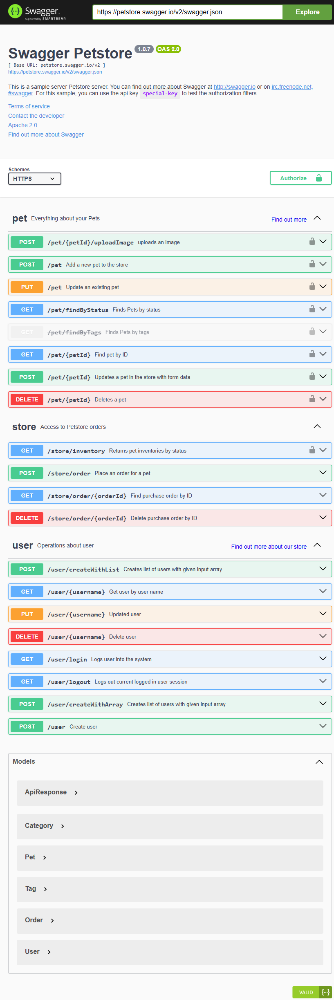
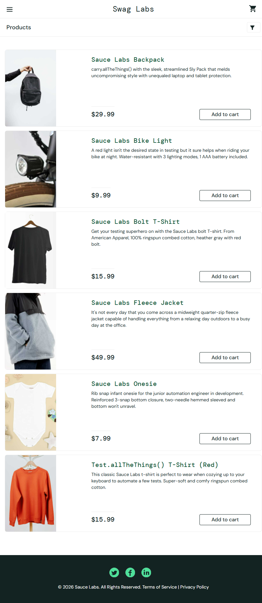

# Projeto de Automacao de Testes

Repositorio unico com duas automacoes integradas a CI:

- API: Swagger Petstore
- Web: SauceDemo

O projeto foi estruturado para atender ao enunciado da disciplina com foco em organizacao, reuso, Page Objects, Service Layer, assercoes objetivas e execucao automatica via GitHub Actions.

## Objetivo

Avaliar e demonstrar uma solucao completa de automacao de testes cobrindo:

- endpoints principais de API para `User`, `Store` e `Pet`
- fluxo funcional E2E web com login, adicao ao carrinho e finalizacao de compra
- pipeline de CI executando os dois tipos de automacao no mesmo repositorio

## Tecnologias Utilizadas

| Tecnologia | Uso no projeto |
|---|---|
| Python 3.12+ | linguagem principal |
| pytest | execucao e organizacao dos testes |
| requests | consumo da API Swagger Petstore |
| Selenium 4 | automacao web do SauceDemo |
| Allure Pytest | geracao de resultados para relatorios |
| python-dotenv | configuracao via variaveis de ambiente |
| Docker | execucao containerizada |
| GitHub Actions | pipeline de CI |

## Estrutura do Projeto

```text
test-automation-project/
├── api/
│   ├── models/            # modelos e validacoes de resposta
│   ├── services/          # camada de servicos HTTP
│   └── tests/             # testes de API
├── web/
│   ├── pages/             # Page Objects
│   ├── tests/             # testes E2E
│   └── utils/             # configuracao de driver
├── .github/workflows/     # pipeline CI
├── docs/screenshots/      # prints para README/apresentacao
├── Dockerfile
├── docker-compose.yml
├── pytest.ini
└── requirements.txt
```

## Boas Praticas Aplicadas

- `Page Object Model` na automacao web
- `Service Layer` na automacao de API
- separacao entre testes, modelos, servicos e utilitarios
- uso de `markers` do pytest para isolar suites API e Web
- codigo com comentarios minimos, apenas quando realmente agregam contexto
- pipeline unica com jobs separados para API e Web

## Como Instalar

Pre-requisitos:

- Python 3.12 ou superior
- Google Chrome instalado
- Git

```bash
git clone https://github.com/SEU-USUARIO/test-automation-project.git
cd test-automation-project
python -m venv .venv
.venv\Scripts\activate
pip install -r requirements.txt
copy .env.example .env
```

## Como Executar

### Executar todos os testes

```bash
pytest -v
```

### Executar somente API

```bash
pytest -m api -v --alluredir=allure-results-api
```

### Executar somente Web

```bash
pytest -m web -v --alluredir=allure-results-web
```

### Abrir relatorio Allure

```bash
allure serve allure-results-api
allure serve allure-results-web
```

## Execucao com Docker

```bash
docker-compose build
docker-compose run --rm tests pytest -m api -v
docker-compose run --rm tests pytest -m web -v
docker-compose run --rm tests pytest -v
```

## Pipeline CI

O projeto possui uma unica pipeline em [.github/workflows/ci.yml](.github/workflows/ci.yml) com dois jobs independentes:

- `API Tests`: instala dependencias, executa `pytest -m api` e publica os artefatos do Allure
- `Web Tests`: instala Chrome, executa `pytest -m web` em modo headless e publica os artefatos do Allure

A pipeline e disparada automaticamente em `push` e `pull_request`, cobrindo as duas automacoes exigidas pela professora.

## Variaveis de Ambiente

| Variavel | Valor padrao | Descricao |
|---|---|---|
| `BASE_URL` | `https://petstore.swagger.io/v2` | base da API Swagger Petstore |
| `SAUCE_URL` | `https://www.saucedemo.com` | URL do sistema web |
| `SAUCE_USER` | `standard_user` | usuario do SauceDemo |
| `SAUCE_PASSWORD` | `secret_sauce` | senha do SauceDemo |
| `HEADLESS` | `true` | execucao headless do Chrome |

## Cobertura Implementada

### API - Swagger Petstore

| Recurso | Cobertura |
|---|---|
| `Pet` | criar, consultar por ID, atualizar, deletar, buscar por status, cenario 404 e validacao de schema |
| `User` | criar, consultar por username, atualizar, deletar, login, cenario 404 e validacao de schema |
| `Store` | inventario, criar pedido, consultar pedido, deletar pedido e cenario 404 |

### Web - SauceDemo

| Cenario | Validacao |
|---|---|
| login | navegacao para a pagina de inventario |
| carrinho | os dois produtos escolhidos aparecem no carrinho |
| checkout | exibicao da mensagem final `Thank you for your order!` |

## Prints do Funcionamento

### Swagger Petstore



### SauceDemo



## O que Mostrar na Apresentacao

- estrutura unica do repositorio com API e Web
- organizacao em `services`, `models`, `pages` e `tests`
- execucao dos comandos `pytest -m api` e `pytest -m web`
- pipeline do GitHub Actions executando os dois jobs
- pontos de design adotados para deixar a automacao reutilizavel e legivel

